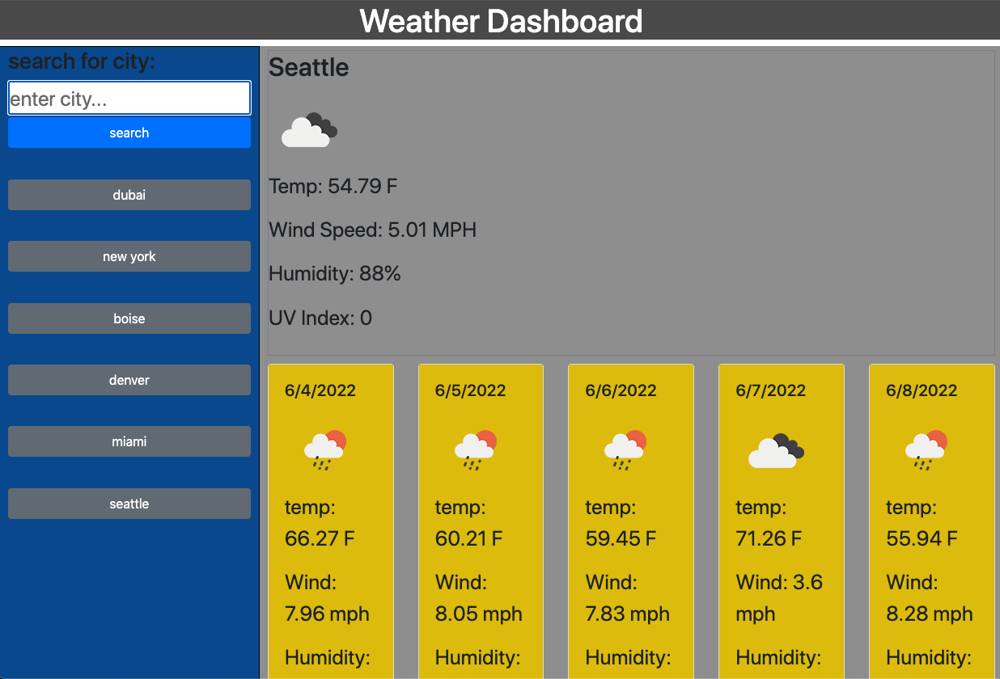

# Weather-Dashboard

## Summary

This application uses a weather API to pull the weather
forecast for any city the user searches for along with a five day
forecast that includes:
* Tempurature
* Wind Speed
* Humidity
* UV Index

 Every time the user searches for a city the previous searches will
 be saved into local storage and be displayed to the user as a button
 in order to see previous searches. 

 This project uses Weather API from https://openweathermap.org/

 ## Tools
 * HTML 
 * CSS
 * JavaScript
 * 3rd Party API

 ## Deployed Page
https://davidpascual2.github.io/Weather-Dashboard/
 ## Repository Link
https://github.com/davidpascual2/Weather-Dashboard
 ## Preview 
 